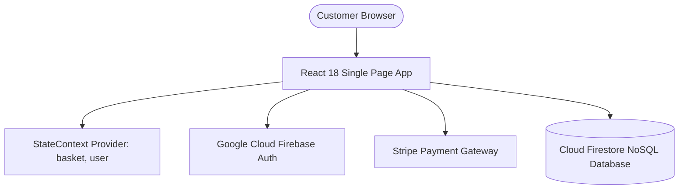
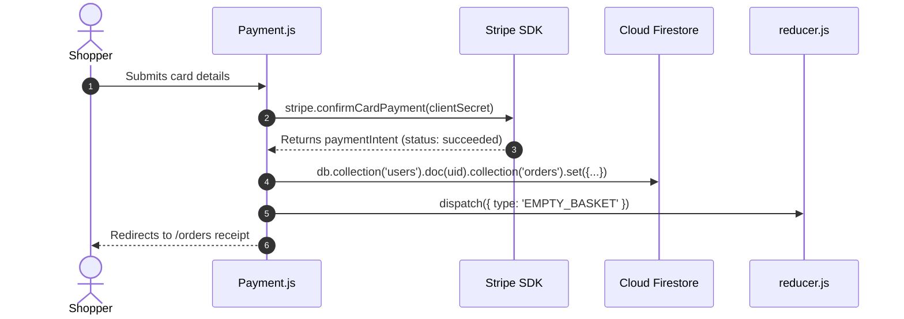

# Architecture & System Design: Amazon Clone

## High-Level Architecture Overview

```mermaid
flowchart TD
    Browser([Customer Browser]) --> App[React 18 Single Page App]
    App --> Context[StateContext Provider: basket, user]
    App --> FirebaseAuth[Google Cloud Firebase Auth]
    App --> Stripe[Stripe Payment Gateway]
    App --> Firestore[(Cloud Firestore NoSQL Database)]
```

---

## Payment Lifecycle Sequence Diagram

```mermaid
sequenceDiagram
    autonumber
    actor Customer as Shopper
    participant Payment as Payment.js
    participant Stripe as Stripe SDK
    participant Firestore as Cloud Firestore
    participant Reducer as reducer.js

    Customer->>Payment: Submits card details
    Payment->>Stripe: stripe.confirmCardPayment(clientSecret)
    Stripe-->>Payment: Returns paymentIntent (status: succeeded)
    Payment->>Firestore: db.collection('users').doc(uid).collection('orders').set({...})
    Payment->>Reducer: dispatch({ type: 'EMPTY_BASKET' })
    Payment-->>Customer: Redirects to /orders receipt
```
